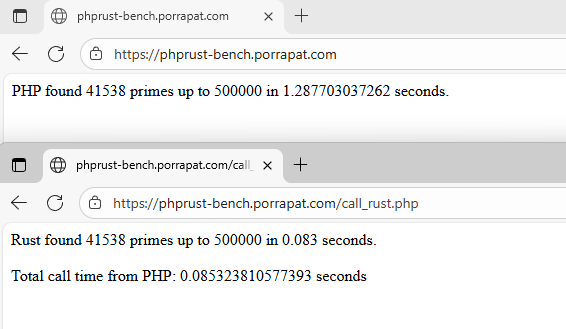
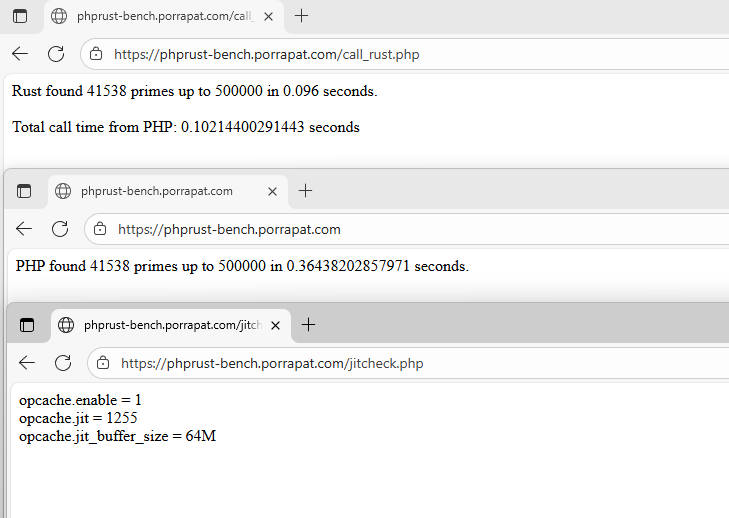
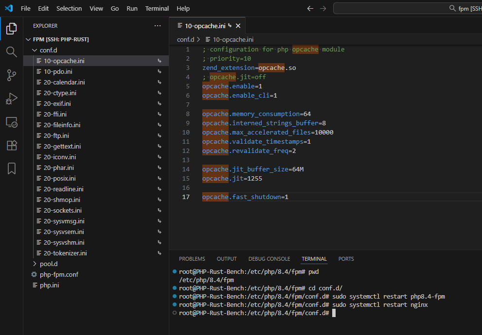

# phprust-bench (ภาษาไทย)

โปรเจกต์นี้สร้างขึ้นเพื่อเปรียบเทียบ **ความเร็วระหว่าง PHP และ Rust** ในการคำนวณหาจำนวนเฉพาะ (prime numbers)

โดย PHP จะเรียกใช้โปรแกรม Rust ที่คอมไพล์แล้วผ่านคำสั่ง `shell_exec()` เพื่อให้ Rust ทำงานคำนวณที่ใช้ CPU หนักแทน PHP และวัดเวลาทำงานทั้งหมดเพื่อดูความแตกต่างของประสิทธิภาพ

ไม่เปิด Jit และ Opcache



เปิด Jit และ Opcache



วิธีการเซ็ต Opcache และ JIT



---
## 🔗 English version
[English version (Readme.md)](Readme.md)

---

## 🚀 ภาพรวมของระบบ

| ภาษา | วิธีการ | รายละเอียด |
|-------|-----------|--------------|
| **PHP** | ใช้ลูปปกติ | คำนวณ prime number แบบวนลูปธรรมดา ตรวจหาระยะหารลงตัว เป็น single-thread (ช้า) |
| **Rust** | โปรแกรมคอมไพล์ | เร็วมากเพราะไม่มี Gabage-Collector |

---

## 🌐 ตัวอย่างการทำงานจริง (Live Demo)

สามารถเข้าชมตัวอย่างการทำงานจริงได้ที่:

- **หน้าแรก:** [https://phprust-bench.porrapat.com/](https://phprust-bench.porrapat.com/)
- **ตัวอย่างการเรียกใช้ Rust:** [https://phprust-bench.porrapat.com/call_rust.php](https://phprust-bench.porrapat.com/call_rust.php)

### 💻 สเปกเซิร์ฟเวอร์
โปรเจกต์นี้รันอยู่บน **Droplet ขนาดเล็กที่สุด** ของ **DigitalOcean (ภูมิภาค SGP1)**:

```
PHP-Rust-Bench
512 MB RAM / 10 GB Disk / SGP1 - Ubuntu 25.10 x64
```

สามารถทดสอบ benchmark ด้วยการกำหนดค่า `limit` เองได้ (ค่าเริ่มต้นคือ 500,000):

```bash
https://phprust-bench.porrapat.com/?limit=100000
https://phprust-bench.porrapat.com/?limit=400000
https://phprust-bench.porrapat.com/?limit=800000
https://phprust-bench.porrapat.com/call_rust.php?limit=100000
https://phprust-bench.porrapat.com/call_rust.php?limit=400000
https://phprust-bench.porrapat.com/call_rust.php?limit=800000
https://phprust-bench.porrapat.com/call_rust.php?limit=2000000
```

และสามารถลองใช้อัลกอรึทึมที่เร็วกว่า Sieve of Eratosthenes:
Thank you from [Katopz](https://github.com/katopz)

```bash
https://phprust-bench.porrapat.com/eratos.php?limit=100000
https://phprust-bench.porrapat.com/eratos.php?limit=400000
https://phprust-bench.porrapat.com/eratos.php?limit=800000
https://phprust-bench.porrapat.com/call_rust_eratos.php?limit=100000
https://phprust-bench.porrapat.com/call_rust_eratos.php?limit=400000
https://phprust-bench.porrapat.com/call_rust_eratos.php?limit=800000
https://phprust-bench.porrapat.com/call_rust_eratos.php?limit=2000000
```

> ค่า `limit` คือจำนวนสูงสุดที่ระบบจะใช้ในการตรวจหาจำนวนเฉพาะ (prime numbers)

ฝั่ง **PHP** จำกัดสูงสุดที่ **2,000,000**
ส่วนฝั่ง **Rust** รองรับได้ถึง **20,000,000**
เพื่อป้องกันการใช้หน่วยความจำเกินหรือทำให้ประสิทธิภาพลดลงบนเซิร์ฟเวอร์ขนาดเล็ก

---

## 🔧 ขั้นตอนการใช้งาน

### 1. คอมไพล์ Rust

```bash
cargo build --release --bin phprust-bench
cargo build --release --bin phprust-bench-eratos
```

จะได้ไฟล์ที่ `target/release/phprust-bench` (หรือ `.exe` บน Windows)


## 🧠 ตัวอย่างผลลัพธ์

```
Rust found 148933 primes up to 2000000 in 0.108 seconds.
Total call time from PHP: 0.154 seconds.
```

---

## 🧩 รองรับหลายระบบปฏิบัติการ

- ✅ **Windows** – ใช้ `.exe` และ backslash (`\\`)
- ✅ **Linux / macOS** – ใช้ binary ปกติ (`./target/release/phprust-bench`)

---

## 🧱 License

MIT License © 2025 Porrapat Petchdamrongskul


## Contributors

Special thanks to [Katopz](https://github.com/katopz)  
สำหรับการแนะนำ Sieve of Eratosthenes algorithm.